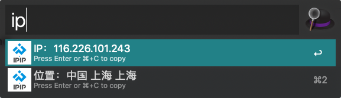

# alfred-local-ip-address-workflow

这是一个[Alfred 3](https://www.alfredapp.com/) workflow，用于获取本地IP地址及其地理位置。

An [Alfred 3](https://www.alfredapp.com/) workflow for getting your local IP address and its geo location.

## Installation

1. [Download the workflow](https://github.com/domainname/alfred-local-ip-address-workflow/releases/latest).
2. Double click the `.alfredworkflow` file to install.

Note that [Alfred Powerpack](https://www.alfredapp.com/powerpack/) is required to use workflows.

## Usage

1. Simply type `ip` to trigger the workflow.
2. Select IP address or geo location if you would like to copy one of them.
3. Press `Enter` or  `⌘ + C` to copy to clipboard.
